# Online Movie & Event Ticket Booking Platform - Database Architecture

This document describes the design and relationships of the normalized PostgreSQL database (3NF) built with Sequelize ORM.

## ER Diagram (Mermaid)

```mermaid
erDiagram
    roles ||--o{ users : "has"
    cities ||--o{ users : "resides_in"
    cities ||--o{ theatres : "contains"
    cities ||--o{ events : "contains"
    users ||--o{ theatres : "owns"
    users ||--o{ events : "organizes"
    users ||--o{ user_refresh_tokens : "signs"
    users ||--o{ bookings : "makes"
    users ||--o{ wishlists : "saves"
    users ||--o{ reviews : "writes"
    users ||--o{ notifications : "receives"
    users ||--o{ support_tickets : "opens"
    theatres ||--o{ screens : "contains"
    screens ||--o{ seats : "has"
    screens ||--o{ shows : "schedules"
    movies ||--o{ shows : "screened_in"
    movies ||--o{ movie_casts : "has_actors"
    movies ||--o{ reviews : "reviewed_by"
    movies ||--o{ wishlists : "saved_in"
    events ||--o{ wishlists : "saved_in"
    event_categories ||--o{ events : "categorizes"
    events ||--o{ event_tickets : "sells"
    event_tickets ||--o{ bookings : "booked_in"
    shows ||--o{ bookings : "booked_in"
    bookings ||--o{ booking_seats : "allocates"
    seats ||--o{ booking_seats : "reserved_by"
    bookings ||--o{ payments : "paid_by"
    payments ||--o{ refunds : "refunds_payment"

    roles {
        uuid id PK
        string role_name
        timestamp created_at
        timestamp updated_at
        timestamp deleted_at
    }

    cities {
        uuid id PK
        string city_name
        string state
        string country
        string status
        timestamp created_at
        timestamp updated_at
        timestamp deleted_at
    }

    users {
        uuid id PK
        string full_name
        string email UK
        string phone UK
        string password_hash
        string profile_image
        uuid role_id FK
        uuid city_id FK
        string status
        boolean email_verified
        boolean phone_verified
        timestamp last_login
        timestamp created_at
        timestamp updated_at
        timestamp deleted_at
    }

    user_refresh_tokens {
        uuid id PK
        uuid user_id FK
        text token
        timestamp expires_at
        timestamp created_at
        timestamp updated_at
    }

    movies {
        uuid id PK
        string title
        text description
        string poster
        string banner
        string language
        string genre
        integer duration
        string age_rating
        date release_date
        string trailer_url
        string status
        timestamp created_at
        timestamp updated_at
        timestamp deleted_at
    }

    movie_casts {
        uuid id PK
        uuid movie_id FK
        string actor_name
        string character_name
        string photo
        timestamp created_at
        timestamp updated_at
        timestamp deleted_at
    }

    theatres {
        uuid id PK
        uuid owner_id FK
        uuid city_id FK
        string theatre_name
        text address
        decimal latitude
        decimal longitude
        string phone
        string email
        text description
        string status
        timestamp created_at
        timestamp updated_at
        timestamp deleted_at
    }

    screens {
        uuid id PK
        uuid theatre_id FK
        string screen_name
        integer capacity
        integer rows
        integer columns
        timestamp created_at
        timestamp updated_at
        timestamp deleted_at
    }

    seats {
        uuid id PK
        uuid screen_id FK
        string seat_number
        string seat_type
        decimal price
        timestamp created_at
        timestamp updated_at
        timestamp deleted_at
    }

    shows {
        uuid id PK
        uuid movie_id FK
        uuid screen_id FK
        date show_date
        time start_time
        time end_time
        string language
        string format
        string status
        timestamp created_at
        timestamp updated_at
        timestamp deleted_at
    }

    bookings {
        uuid id PK
        string booking_number UK
        uuid user_id FK
        uuid show_id FK
        uuid event_ticket_id FK
        timestamp booking_date
        decimal total_amount
        decimal discount
        string booking_status
        string payment_status
        string qr_code
        string ticket_pdf
        timestamp created_at
        timestamp updated_at
        timestamp deleted_at
    }

    booking_seats {
        uuid id PK
        uuid booking_id FK
        uuid seat_id FK
        decimal price
        timestamp created_at
        timestamp updated_at
        timestamp deleted_at
    }

    payments {
        uuid id PK
        uuid booking_id FK
        string transaction_id UK
        string gateway
        string payment_method
        decimal amount
        string status
        timestamp paid_at
        timestamp created_at
        timestamp updated_at
        timestamp deleted_at
    }

    refunds {
        uuid id PK
        uuid payment_id FK
        decimal amount
        string reason
        string status
        timestamp created_at
        timestamp updated_at
        timestamp deleted_at
    }

    events {
        uuid id PK
        uuid organizer_id FK
        uuid category_id FK
        string title
        text description
        string venue
        uuid city_id FK
        string banner
        timestamp start_date
        timestamp end_date
        string status
        timestamp created_at
        timestamp updated_at
        timestamp deleted_at
    }

    event_categories {
        uuid id PK
        string category_name UK
        timestamp created_at
        timestamp updated_at
        timestamp deleted_at
    }

    event_tickets {
        uuid id PK
        uuid event_id FK
        string ticket_type
        decimal price
        integer available_quantity
        timestamp created_at
        timestamp updated_at
        timestamp deleted_at
    }

    wishlists {
        uuid id PK
        uuid user_id FK
        uuid movie_id FK
        uuid event_id FK
        timestamp created_at
        timestamp updated_at
        timestamp deleted_at
    }

    reviews {
        uuid id PK
        uuid movie_id FK
        uuid user_id FK
        integer rating
        text review
        timestamp created_at
        timestamp updated_at
        timestamp deleted_at
    }

    notifications {
        uuid id PK
        uuid user_id FK
        string title
        text message
        string type
        boolean is_read
        timestamp created_at
        timestamp updated_at
        timestamp deleted_at
    }

    coupons {
        uuid id PK
        string coupon_code UK
        string discount_type
        decimal discount_value
        decimal minimum_amount
        timestamp expiry_date
        integer usage_limit
        string status
        timestamp created_at
        timestamp updated_at
        timestamp deleted_at
    }

    support_tickets {
        uuid id PK
        uuid user_id FK
        string subject
        text message
        string status
        timestamp created_at
        timestamp updated_at
        timestamp deleted_at
    }
```

## Schema Normalization (3NF)

The database schema has been strictly designed in 3NF to avoid data redundancy and update anomalies:
1. **No repeating groups (1NF)**: Every table cell contains single atomic values, and every record has a unique identifier (UUID v4).
2. **Full functional dependency (2NF)**: All non-key attributes are fully dependent on the primary keys. Relational junction tables like `booking_seats` map ticket configurations cleanly.
3. **No transitive dependencies (3NF)**: Fields depend solely on the primary key (e.g., event descriptions belong strictly in the `events` table, and event category details are segmented into `event_categories`).

## Key Indexes & Constraints

To ensure production performance, indexes and database-level constraints are defined:
- **Unique Indexes**: 
  - `users`: `email` (Unique), `phone` (Unique)
  - `seats`: `(screen_id, seat_number)` (Unique) to prevent double seating configurations.
  - `bookings`: `booking_number` (Unique)
  - `payments`: `transaction_id` (Unique)
  - `wishlists`: `(user_id, movie_id)` (Unique), `(user_id, event_id)` (Unique)
  - `reviews`: `(movie_id, user_id)` (Unique) - limiting reviews to one per user per movie.
- **Check Constraints**:
  - Valid latitude (-90 to 90) and longitude (-180 to 180) for `theatres`.
  - Seat type validation enum check constraints.
  - Positive numeric fields for pricing (`price`, `total_amount`, `discount`, `amount`).
